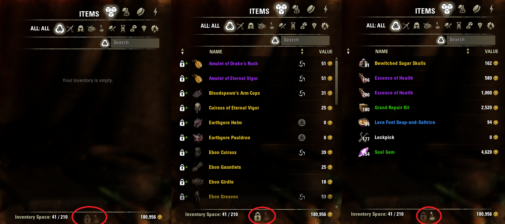

# HideInventoryClutter

A libFilter3 based addon that adds a toggle to hide unnecessary inventory clutter from your sight (enabled by default after logging in). It's best used with [Personal Assistant](https://www.esoui.com/downloads/info381-PersonalAssistantBankingJunkLootRepair.html) configured to automatically mark and sell junk for you, which effectively hides everything you define as junk from your view.

# Getting started

This addon's UI consists of 2 clickable icons that can be placed anywhere on the screen. They become visible and active when you open inventory menu (or any other menu that displays your inventory's content, ie., bank or merchant). 
To move icons to your desired position, open addon settings and unlock icons. Now you can open/close inventory and position them at will. Once done, simply open addon settings again and lock them again. 
If you don't like one or more of the filters, they can all be disabled individually in the settings panel.

# Locked items 

Most players cary multiple gear sets in their inventories, and obviously, they are aware of the fact. Now you can toggle visibility of locked items with just one click. 

_This filter is currently being unintentionally applied to bank/chest withdraw window as well. I am yet to find a workaround for this issue. Apologies for the inconvenience._

# Consumables

Items that everyone carries at all times, seeing them is unnecessary except for restocking or selling excess amounts. Toggle applies to:

- Lockpick
- Grand Repair Kit
- Soul Gem

- buff food and drinks
- potions
- poisons

_This filter is currently being unintentionally applied to bank/chest withdraw window as well. I am yet to find a workaround for this issue. Apologies for the inconvenience._

# Deconstruction filters

This addon determines whether something is worth deconstructing, ie., if materials gained from deconstruction are likely to be worth more than the amount of gold that merchant offers. Items that will appear in the deconstruction window by default meet those criteria:

- Not a player-made enchant. While worth deconstructing, I assume that player-made enchants are meant to be used or sold in guild store in the near future.
- Green or above quality jewelry. Terne Grains are not particularly expensive, but it's still worth more than selling an item to the merchant.
- Purple or above quality gear. Blue and green upgrade materials are cheap, prices offered by merchant are superior. This check does not account for rare style materials that could be obtained by deconstructing items of lower quality. The reasoning behind this is simplicity, most of style materials aren't worth much and the rare ones are, well, rare.

To toggle visibility in deconstruction menu use the **Lock** icon (that otherwise has no effect as locked items cannot be deconstructed without unlocking them first). Best used with [DoItAll](https://www.esoui.com/downloads/info690-DoItAllMassExtractDeconstructMoveMailattach....html) to just 1-click decon all without thinking. Just don't blame me for deconstructing any not-locked set items you wanted to keep, or things you wanted to sell.

# Merchant filters

Items considered worth deconstructing, ie., purple gear (see full criteria above) will be hidden from the merchant sell window. Additionally, crafting materials are also hidden. This filter is targeted at people who decided to play the game without ESO+ membership and therefore carry materials in their inventory (before depositing them in bank. Once again my recommendation for automating all that goes to [Personal Assistant](https://www.esoui.com/downloads/info381-PersonalAssistantBankingJunkLootRepair.html). To toggle visibility in merchant sell window use the **Lock** icon (that otherwise has no effect as locked items cannot be sold before unlocking them first).

# Known bugs

As mentioned before, inventory (locked items and consumables) filters are currently being applied to (house) bank withdrawal panel. This is unintentional and hopefully will be fixed in the future. If you want to withdraw locked/consumable items, you need to toggle the filter first.

