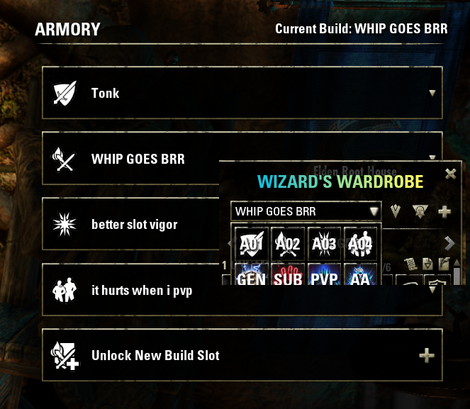

# Schrodi's Wardrobe

An extension that makes WizardsWardrobe more armory friendly. Features:

- Creates a setup with an icon (updates on reloadui / relog) for each armory build available.

- Automatically switches to armory build page after loading armory build.
- Auto-equips first setup (if auto equip is enabled in WW settings)
- With auto-equip enabled, it will auto-select trial page upon entering a trial (default WW behaviour) and disable auto equip. You can now manually choose a correct page (ie. DPS, portal DPS, kite healer, main tank, etc.) and re-enable auto-equip once on the correct page. WW will equip setups automatically as usual.
- It will automatically change page back to the last equipped armory build upon leaving the trial zone.
